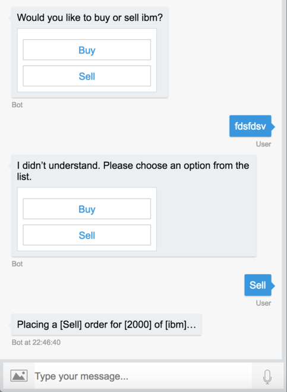

# OMS with MS Bot framework + LUIS recogniser

* Bot integration with Luis via LuisRecognizer

* Order dialog with homemade Luis entity validation via waterfall

* Basic support for validation exceptions and interruptions

### Issues / Next Steps
* Can we make use of [LUIS action binding example framework](https://github.com/ahilton/BotBuilder-Samples/tree/master/Node/blog-LUISActionBinding) to do a better job of LUIS entity validation
* Can we easily integrate with [speech-enabled channel](https://docs.microsoft.com/en-us/bot-framework/nodejs/bot-builder-nodejs-text-to-speech)? (e.g. Cortana)
* Send events to UI to support ambient info display
* Trigger action & end dialog 

### Prerequisites

* Latest Node.js with NPM. Download it from [here](https://nodejs.org/en/download/).
* The Bot Framework Emulator. To install the Bot Framework Emulator, download it from [here](https://emulator.botframework.com/). 
* An instance of LUIS(.ai) configured and trained using the luis.json project file. Deploy staging end point and add url to .env file.

### Running (locally)

Within project directory:
* npm install
* node app.js

Start bot emulator:
* Connect with default params: http://localhost:3978/api/messages

### Useful docs

* https://github.com/ahilton/BotBuilder-Samples/tree/master/Node/blog-LUISActionBinding
* https://docs.botframework.com/en-us/node/builder/calling-reference/modules/_botbuilder_d_.html
